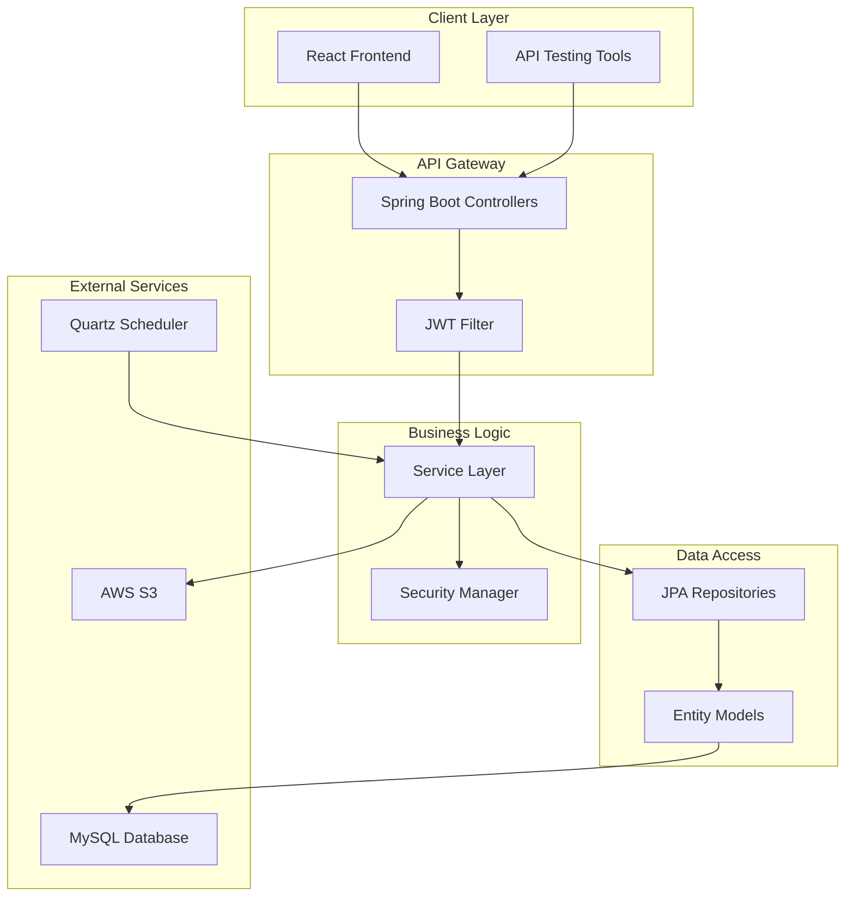

# 🎓 Learning Management System (LMS)

<div align="center">


A full-featured Learning Management System backend built with Spring Boot, designed to handle course management, student enrollments, and content delivery at scale.

[Features](#-features) • [Architecture](#-architecture) • [Getting Started](#-getting-started) • [API Documentation](#-api-documentation) • [Deployment](#-deployment)

</div>

---

## 📖 About The Project

This Learning Management System is a robust backend solution I built to demonstrate modern enterprise application development. It handles everything from user authentication to course management, with a focus on security, scalability, and clean architecture.

**What makes this project special:**

- Production-grade security with JWT and role-based access control
- Scalable file storage using AWS S3
- Automated reminder system with Quartz Scheduler
- Interactive API documentation via Swagger
- Clean, maintainable code following best practices

## ✨ Features

### 🔐 Security & Authentication

- **JWT-based Authentication** - Stateless token-based auth for scalability
- **Role-Based Access Control** - Three distinct roles (Admin, Teacher, Student)
- **Spring Security Integration** - Industry-standard security framework
- **Password Encryption** - BCrypt hashing for user credentials

### 📚 Course Management

- **CRUD Operations** - Complete course lifecycle management
- **Instructor Assignment** - Link courses to specific teachers
- **Course Metadata** - Titles, descriptions, thumbnails
- **Soft Delete** - Admin controls for course removal

### 👥 User Management

- **Multi-role Support** - Admins, Teachers, and Students
- **User Registration** - Self-service account creation
- **Profile Management** - User information handling
- **Role Assignment** - Dynamic role allocation by admins

### 📝 Enrollment & Progress

- **Student Enrollment** - Course registration system
- **Progress Tracking** - Monitor student advancement
- **Completion Status** - Track course completion rates
- **Enrollment History** - View past and current enrollments

### ☁️ Cloud Integration

- **AWS S3 Storage** - Scalable file hosting for course materials
- **Automatic File Management** - Unique key generation for uploads
- **URL Generation** - Direct access links for stored content
- **Cleanup Handlers** - Proper file deletion on content removal

### ⏰ Automation

- **Quartz Scheduler** - Daily reminder system for enrolled students
- **Cron-based Jobs** - Scheduled at 9:00 AM daily
- **Extensible Design** - Easy to add new scheduled tasks
- **Error Handling** - Robust job execution with logging

### 📄 API Documentation

- **Swagger UI** - Interactive API exploration at `/swagger-ui.html`
- **OpenAPI 3.0** - Standard API specification
- **JWT Integration** - Test authenticated endpoints directly
- **Auto-generated Docs** - Always up-to-date with code

## 🏗️ Architecture

This application follows a layered architecture pattern with clear separation of concerns:



### 🔄 Request Flow

1. **Client Request** → REST API Controller
2. **JWT Authentication** → Security Filter validates token
3. **Authorization Check** → Role-based access verification
4. **Business Logic** → Service layer processing
5. **Data Persistence** → JPA/Hibernate → MySQL
6. **File Operations** → AWS S3 for content storage
7. **Scheduled Tasks** → Quartz triggers background jobs

## 🛠️ Tech Stack

| Layer             | Technology            | Purpose                        |
| ----------------- | --------------------- | ------------------------------ |
| **Framework**     | Spring Boot 3.3.4     | Application foundation         |
| **Language**      | Java 17               | Core development language      |
| **Database**      | MySQL 8.0             | Relational data storage        |
| **ORM**           | JPA/Hibernate         | Database abstraction           |
| **Security**      | Spring Security + JWT | Authentication & authorization |
| **Cloud Storage** | AWS S3 SDK            | File storage                   |
| **Scheduling**    | Quartz 2.3+           | Background job management      |
| **API Docs**      | Swagger/OpenAPI 3     | Interactive documentation      |
| **Build Tool**    | Maven                 | Dependency management          |
| **Utilities**     | Lombok                | Boilerplate reduction          |

## 🚀 Getting Started

Follow these instructions to get the project up and running on your local machine.

### Prerequisites

Make sure you have the following installed:

- **Java 17** or higher ([Download](https://adoptium.net/))
- **Maven 3.6+** ([Download](https://maven.apache.org/download.cgi))
- **MySQL 8.0+** ([Download](https://dev.mysql.com/downloads/))
- **AWS Account** (for S3 integration)

### Installation

1. **Clone the repository**

   ```bash
   git clone https://github.com/Striver20/Learning-Management-System.git
   cd Learning-Management-System
   ```

2. **Set up MySQL Database**

   ```sql
   CREATE DATABASE lmsdb;
   CREATE USER 'lmsuser'@'localhost' IDENTIFIED BY 'your_password';
   GRANT ALL PRIVILEGES ON lmsdb.* TO 'lmsuser'@'localhost';
   FLUSH PRIVILEGES;
   ```

3. **Configure Environment Variables**

   Create a `.env` file in the `backend` directory:

   ```env
   DB_USERNAME=lmsuser
   DB_PASSWORD=your_password
   AWS_ACCESS_KEY=your_aws_access_key
   AWS_SECRET_KEY=your_aws_secret_key
   ```

4. **Build the project**

   ```bash
   cd backend
   mvn clean install
   ```

5. **Run the application**
   ```bash
   mvn spring-boot:run
   ```

The server will start on `http://localhost:8080`

### 🧪 Testing with Swagger

Once running, navigate to: **http://localhost:8080/swagger-ui.html**

1. **Register a new user**

   - Use `POST /api/auth/register`
   - Choose a role: `ROLE_ADMIN`, `ROLE_TEACHER`, or `ROLE_STUDENT`

2. **Login to get JWT token**

   - Use `POST /api/auth/login`
   - Copy the returned JWT token

3. **Authenticate in Swagger**
   - Click the 🔓 **Authorize** button
   - Enter: `Bearer <your-jwt-token>`
   - Now you can test protected endpoints!

## 📡 API Endpoints

### Authentication

- `POST /api/auth/register` - Register new user
- `POST /api/auth/login` - Login and get JWT token
- `GET /api/auth/users` - Get all users (Admin only)

### Courses

- `POST /api/courses` - Create course (Teacher)
- `GET /api/courses` - Get all courses
- `GET /api/courses/{id}` - Get course by ID
- `GET /api/courses/instructor` - Get courses by instructor
- `DELETE /api/courses/{id}` - Delete course (Admin)

### Content

- `POST /api/contents/upload` - Upload content to AWS S3 (Teacher)
- `POST /api/contents` - Add content to course
- `GET /api/contents` - Get course contents
- `DELETE /api/contents/{id}` - Delete content (Teacher)

### Enrollments

- `POST /api/enrollments` - Enroll student in course
- `GET /api/enrollments/student` - Get student enrollments

### Progress

- `POST /api/progress/update` - Update student progress
- `GET /api/progress` - Get student progress

### Admin

- `GET /api/admin/users` - Get all users
- `POST /api/admin/users/{userId}/role` - Assign role
- `DELETE /api/admin/users/{userId}` - Delete user
- `GET /api/admin/courses` - Get all courses
- `DELETE /api/admin/courses/{courseId}` - Delete course
- `GET /api/admin/enrollments` - Get all enrollments
- `PUT /api/admin/enrollments/{enrollmentId}/status` - Update enrollment status

## 📸 Screenshots

### Swagger API Documentation

> Interactive API documentation with JWT authentication support


### Architecture Overview

> Clean layered architecture following Spring Boot best practices


_Note: Replace placeholder images with actual screenshots of your Swagger UI and architecture diagrams_

## 🌐 Deployment

### Current Status: Development Ready

This application is **production-ready** and designed for AWS deployment. Currently running locally with AWS S3 integration configured.

### AWS Infrastructure (Configured & Ready)

The application is built to deploy on:

- **EC2 Instance**: Free-tier t2.micro for running Spring Boot
- **RDS MySQL**: For production database (currently using local MySQL)
- **S3 Bucket**: Configured for course content storage (`lms-springboot-s3`)
- **Region**: Asia Pacific (Sydney) `ap-southeast-2`

### Local Development Setup ✅

```bash
# Currently running on
Server: localhost:8080
Database: MySQL 8.0 (local)
File Storage: AWS S3 (ap-southeast-2)
```

### Deployment-Ready Features

- ✅ JAR packaging configured
- ✅ Environment variable management
- ✅ AWS S3 SDK integrated
- ✅ Production-grade security
- ✅ Cloud-native architecture

### Quick Deployment Guide (When Ready)

1. **Build production JAR**
   ```bash
   mvn clean package -DskipTests
   ```

2. **Set up AWS RDS MySQL**
   ```sql
   -- Update connection string in application.properties
   spring.datasource.url=jdbc:mysql://your-rds-endpoint:3306/lmsdb
   ```

3. **Deploy to EC2**
   ```bash
   scp -i key.pem target/lms-0.0.1-SNAPSHOT.jar ec2-user@ec2-ip:/home/ec2-user/
   ssh -i key.pem ec2-user@ec2-ip
   java -jar lms-0.0.1-SNAPSHOT.jar
   ```

4. **Configure S3 bucket permissions**
   - Ensure IAM role has S3 access
   - Update bucket policy for public read (if needed)

### Why Not Deployed Yet?

This is a **portfolio/learning project** demonstrating enterprise application development. The focus is on:
- Clean architecture and design patterns
- Production-ready code quality
- AWS integration capabilities
- Modern development practices

_For production deployment, I can set up AWS infrastructure within an hour if needed._

## Project Structure

```
backend/
├── config/          - Security, CORS, S3, Quartz configuration
├── controller/      - REST API endpoints
├── dto/             - Data Transfer Objects
├── entity/          - JPA entities
├── repository/      - Database repositories
├── service/         - Business logic
├── security/        - JWT authentication
├── scheduler/       - Quartz jobs
└── exception/       - Exception handling
```

## 🔮 Future Enhancements

I'm planning to add these features in future iterations:

- [ ] **Email Notifications** - AWS SES integration for course reminders
- [ ] **Real-time Updates** - WebSocket support for live notifications
- [ ] **Analytics Dashboard** - Student performance and course statistics
- [ ] **Video Streaming** - AWS MediaConvert for video content
- [ ] **Multi-language Support** - i18n for international users
- [ ] **Payment Integration** - Stripe/PayPal for paid courses
- [ ] **Discussion Forums** - Student-teacher interaction platform
- [ ] **Mobile API** - Optimized endpoints for mobile apps

## 🤝 Contributing

While this is primarily a portfolio project, I'm open to suggestions and improvements!

1. Fork the repository
2. Create your feature branch (`git checkout -b feature/AmazingFeature`)
3. Commit your changes (`git commit -m 'Add some AmazingFeature'`)
4. Push to the branch (`git push origin feature/AmazingFeature`)
5. Open a Pull Request

## 📝 License

This project is licensed under the MIT License - see the [LICENSE](LICENSE) file for details.

## 👨‍💻 Author

**Striver20**

- GitHub: [@Striver20](https://github.com/Striver20)
- LinkedIn: [Add your LinkedIn](https://linkedin.com/in/your-profile)

## 🙏 Acknowledgments

- Spring Boot team for the excellent framework
- Baeldung and Spring.io for great documentation
- AWS for cloud infrastructure
- The open-source community

---

<div align="center">

**⭐ Star this repo if you find it helpful!**

Made with ❤️ and ☕ by Striver20

</div>
